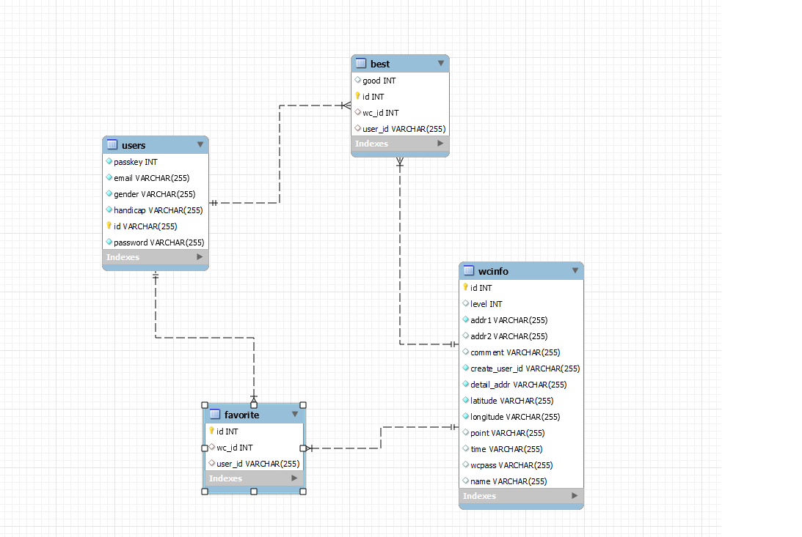
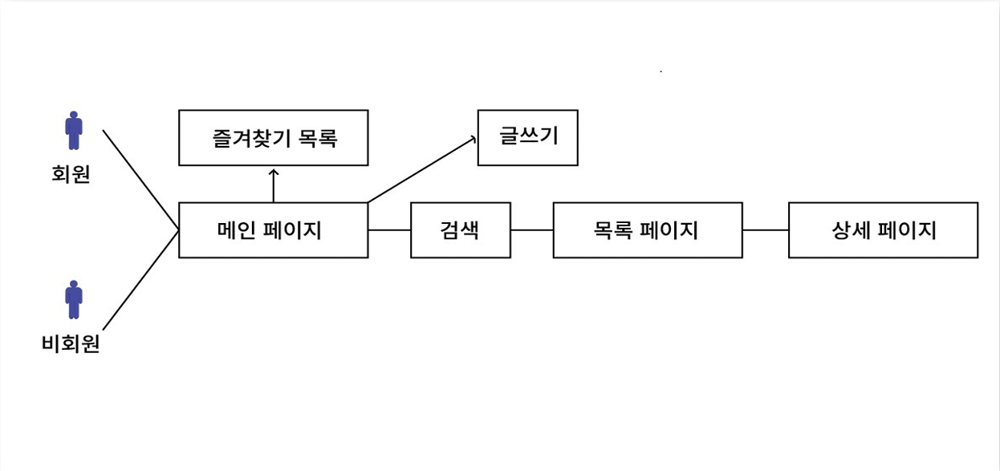

# 🚽 PublicWC
우리들의 공공화장실 프로젝트

# 📝 프로젝트
> 개발기간 : 2024.07.19 ~ 2024.07.31

# 👥 개발인원
> 5명

# 💻 담당역할
> Spring JPA를 사용해 프로젝트 DB생성 관리 좋아요/싫어요 , 즐겨찾기 기능 구현

# 👩‍💻 Skills
1. 백엔드
>

2. 프론트엔드
>

# 📚 ERD & USE-CASE

ERD

USE-CASE

# 주요기능
1. 화장실 탐색
> 지도 API를 사용하여 가까운 역 이름을 검색하여 지도에 화장실을 표시해줍니다.
사용자들은 화장실을 이용하고 해당 화장실에 좋아요/싫어요를 누를 수 있고  맘에드는 화장실을 즐겨찾기 할수 있습니다. 로그인을 하면 내가 즐겨찾기 한 리스트가 메인화면에 출력됩니다.

2.
> 3단계 화장실은 비밀번호가 걸려있는 화장실입니다. 비밀번호는 회원이 소지하고 있는 열쇠로 오픈하여 확인할 수 있습니다.
열쇠는 회원가입시 5개 글 작성시 3개를 얻습니다.
글 작성시 화장실 3단계를 선택하면 비밀번호 작성칸이 활성화되어 화장실 비밀번호를 입력할수 있습니다.
